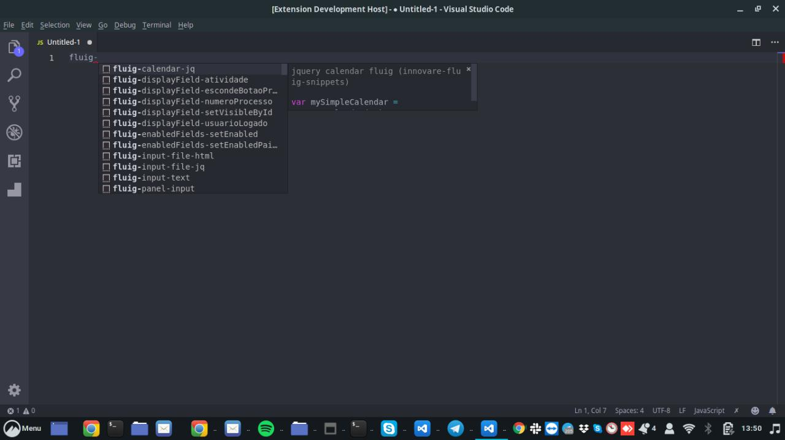

# innovare-fluig-snippets README

Bem vindo ao Innovare fluig snippets

Para facilitar o desenvolvimento fluig, criamos esse pacote de snippets, assim poderemos escrever menos código e tomar mais café :)

## Features

Como adicionar uma snippet no código



> Dica: o código dessa extensão está no github em e você pode ajudar a contribuir para esse plugin

GitHub: https://github.com/innovareti/innovare-fluig-snippets

## Contribuidores

* Elton Nicolau
* Valter Ceratti
* Luiz Postal

## Requisitos

Basta instalar e usar

todos os comandos começam com ```fluig-```

Ex: ```fluig-dataset-novo```

Esse comando irá gerar a seguinte estrutura

```
var dataset = new DatasetBuilder();
``` 

| Comando | Descrição |
| ------------- |:-------------|
| fluig-dataset-novo | Novo Dataset |
| fluig-get-dataset | script para chamada de Dataset Simples |
| fluig-extData | Consultar os dados adicionais do usuário logado no Fluig |
| fluig-calendar-jq | script de ativação de campo de calendário(datepicker)  |
| fluig-input-file-jq | script de ativação de um campo input |
| fluig-panel-input | Gera um panel html |
| fluig-input-text | Gera um input text |
| fluig-calendar-html | gera um input date |
| fluig-textarea-html | gera um textarea |
| fluig-zoom-html | gera um campo zoom |
| fluig-input-file-html | gera um input file |
| fluig-displayField-atividade | script para pegar a atividade no displayFields |
| fluig-displayField-numeroProcesso | script para pegar o número do processo no displayfields |
| fluig-displayField-usuarioLogado | script para buscar o usuário(mátricula) logado no display fields |
| fluig-displayField-escondeBotaoPrint | script para esconder o botão de impressão |
| fluig-displayField-setVisibleById | script para esconder um campo pelo id |
| fluig-enabledFields-setEnabled | script para habilitar um campo ou desabilitar |
| fluig-enabledFields-setEnabledPaiFilho | script para habilitar/desabilitar campos em pai x filho |
| fluig-validateForm | script para validação de formulário |
| fluig-validateForm-paiFilho | script para validação de form pai x filho |
| fluig-swich-aprovacao | script para habilitar um botão switch |
| fluig-get-dataset | Script de busca em dataset |
| fluig-data-atual | Script que retorna uma data atual no formato Brasileiro dd/mm/yyyy |


